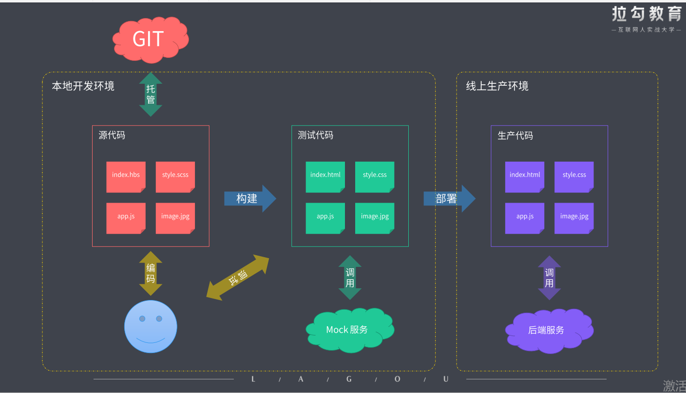

# 1. 前端工程化

全副武装： 通过工程化提升 [战斗力]

以前刀耕火种的模式现在已经不适用了


## 1.1 主要解决的问题

- 传统语言或语法的弊端
  - 想要使用 es6+ 新特性提高我们代码效率，但是有兼容问题
  - 想要使用 Less / Sass / PostCSS 增强 CSS 的 编程性，但是运行环境不能直接支持
- 无法使用模块化 / 组件化
- 重复的机械式工作
  - 部署上线前需要<font color="red">手动</font>压缩代码以及资源文件
  - 部署过程需要<font color="red">手动</font>上传代码到服务器
- 代码风格统一、质量保证
  - 多人协作开发，无法硬性统一大家的代码风格
  - 从仓库中 pull 回来的代码质量无法保证
- 依赖后端服务接口支持
  - 部分功能开发时需要等待后端服务器接口提前完成
- 整体依赖后端项目
- 总结：

如下图是对上述的一种总结


## 1.2 工程化表现

- 一切以提高效率、降低成本、质量保证为目的的手段都属于 [工程化]
- 一切重复的工作都应该被自动化

```js

- 创建项目
  - 创建项目结构
  - 创建特定类型文件
- 编码
  - 格式化代码
  - 校验代码风格
  - 编译 / 构建 / 打包
- 预览 / 测试
  - Web Server / Mock    假接口
  - Live Reloading / HMR  热更新
  - Source Map
- 提交
  - Git Hooks       提交日志做检查
  - Lint-staged     代码检查
  - 持续集成
- 部署
  - CI / CD
  - 自动发布
```

## 1.3 工程化 != 莫个工具

> 工具并不是工程化的核心，工程化的核心应该是对项目整体的一种规划或者架构，而工具只是用来帮我们落地去实现这种规划或者架构的一种手段

如下是工程化示意图



通过上面图得出：工程化是规划一个项目的整体架构,规划文件的组织结构，源代码的开发范式，开发范式就是我们使用什么样的语法，什么样的规划，什么样的标准去编写我们的代码，再一个就是我们做前后端分离是基于 ajax 去分离还是基于中间层去做分离，这些都是我们一开始先明确的一种规划，有了这些整体的规划过后，我们具体去考虑我们应该选择搭配哪些工具去做哪些具体的配置选项,来去实现我们工程化的整体规划。<font color="red">这才是工程化应该有的过程</font>

一些成熟的工程化集成 (下面是特定类型的项目官方出的集成式工程化方案)

- create-react-app
- vue-cli
  - 有什么特定的目录结构 public,src
  - 提供一些工具，热更新开发的服务
  - lint 代码风格的校验
- angular-cli
- gatsby-cli

## 1.4 前端工程化是由 node.js 强力去驱动的

前端工程化是为了解决问题而存在的，切莫为了技术而技术

## 1.5 通过如下 5 个维度去落实前端工程化

- 脚手架工具开发， 可以去看我写的[脚手架工具]("/task2脚手架工具.md")
- 自动化构建系统 可以去看我写的[自动化构建系统]("/task3自动化构建.md")
- 模块化打包
- 项目代码规范化
- 自动化部署
