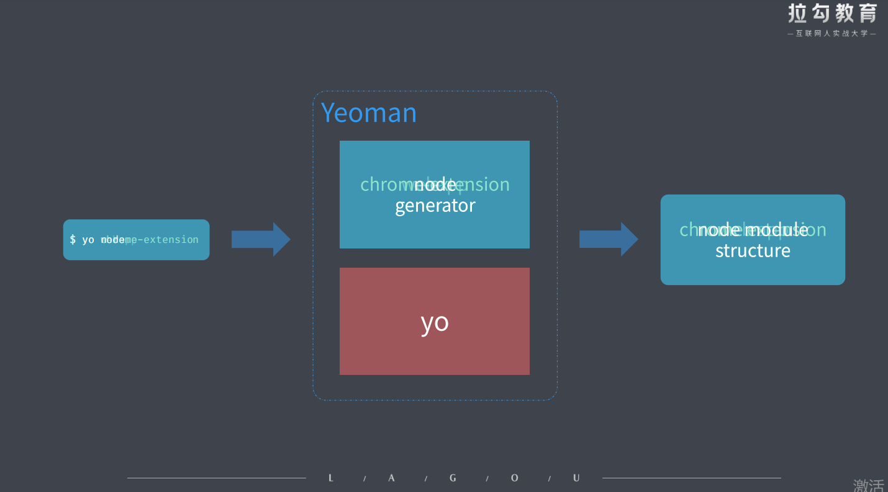
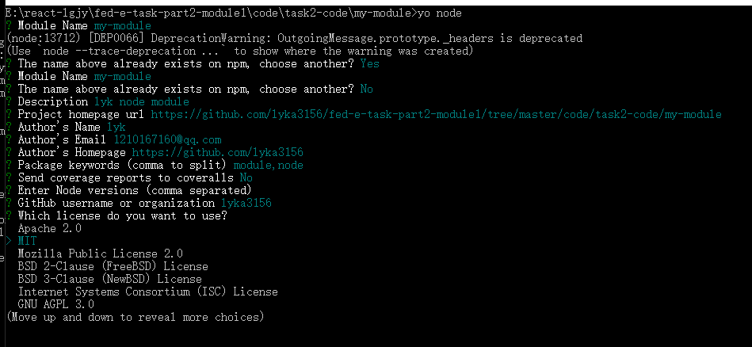
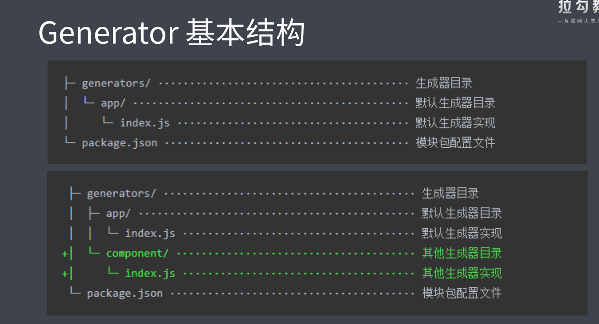

# 2. 脚手架工具 (前端工程化的发起者)

## 2.1 脚手架的本质作用

- 创建项目基础结构、提供项目规范和约定
  - 相同的组织结构
  - 相同的开发范式
  - 相同的模块依赖
  - 相同的工具配置
  - 相同的基础代码

举个例子
IDE 创建项目的过程就是一个脚手架的工作流程 (例如：Android Studio 创建安卓项目)

前端脚手架

- 前端脚手架不会集成在莫个 IDE 中，是以独立的工具存在，相对会复杂一些，本质上脚手架的目的都是一样的，都是为了解决在创建项目过程中那些复杂的工作。

## 2.2 常用的脚手架工具

创建项目的脚手架工具

- React.js 项目 -> create-react-app
- Vue.js 项目 -> vue-cli
- Angular 项目 -> angular-cli
  上面这些工具实现都大同小异，无外乎都是根据信息创建对应的项目基础结构,只适用于自身服务的那个框架的项目

- Yeoman 通用性脚手架工具

在项目开发过程中创建一些特定类型的文件

- Plop
  - 例如创建一个组件 / 模块所需要的文件

### 2.2.1 Yeoman

通用性的项目脚手架工具，他可以根据模板生成一个对应的项目结构，这种脚手架一般都很灵活，很容易扩展

Yeoman 作为最老牌，最强大，最通用的一款脚手架工具，他有更多值得我们借鉴学习的地方

Yeoman 优点：

- Yeoman 可以搭配不同的 generator 去创建任何类型的项目，也就是说我们可以通过创建自己的 generator 从而去定制属于我们的自己前端脚手架，如下图所示



Yeoman 缺点：在很多专注框架开发的人眼中 Yeoman 过于通用不够专注所以他们更喜欢使用像 vue-cli 这种的脚手架

Yeoman 基本使用

- 在全局范围安装 yo

```js
npm install yo --global # or  yarn global add yo
```

- 安装对应的 generator

```js
npm install generator-node --global # or  yarn global add generator-node
```

- 通过 yo 运行 generator

```js
cd path/to/project-dir
mkdir lyk-my-module
yo node   // node_12以上不支持该命令了outgoingMessage._headers, outgoingMessage._headerNames
```



### 2.2.1.1 Yeoman 的 Sub Generator

在已有项目基础上创建一些特殊类型的文件

使用 generator-node 提供的一个子集生成器叫 cli 的生成器去帮我们生成一个叫 cli 应用所需要的文件，让我们这个模块变成 cli 应用

```js
// 在上一个my-module项目中运行如下命令创建generator的子集
yo node:cli
// 使用 yarn link 将这个模块作为全局的命令行模块去运行了
yarn link
```

需要注意的是并不是每个 generator 都提供子集,通过 generator 官方文档来去明确这个 generator 下面有没有子集的生成器 (例如：[generator-node 的子集](https://github.com/yeoman/generator-node))

### 2.2.1.2 Yeoman 常规使用步骤

1. 明确你的需求；
2. 找到合适的 Generator; generator-node
3. 全局范围安装找到的 Generator; yarn global add generator-node
4. 通过 Yo 运行对应的 Generator; yo node
5. 通过命令行交互填写选项;
6. 生成你所需要的项目结构；

### 2.2.1.3 自定义 Generator

基于 Yeoman 搭建自己的脚手架

### 2.2.1.4 创建 Generator 模块

Generator 介绍

- Generator 本质上是一个 NPM 模块
- Generator 模块名称必须遵循 generator-<font><name></font> 的格式
- Generator 基本结构示例图如下:



通过上图可以看出 generators 的 app 就是默认生成器目录，app/index.js 就是默认生成器实现，而 app 的同级目录就是 generator 的子集。

#### 2.2.1.4.1 通过上述介绍我们创建属于自己的 Generator 如下所示：

```js
// 1. 创建目录
mkdir generator-sample

// 2. 初始化项目依赖
yarn init -y

// 3. 安装generator生成器的基类,这个基类提供一些工具函数让我们在对创建生成器的时候更加便捷
yarn add yeoman-generator

// 4. 在项目中创建一个generators/app的文件夹
// index.js 文件作为 Generator 的核心入口
// 1. 需要导出一个继承自 Yeoman Generator 的类型
// 2. Yeoman Generator 在工作时会自动调用我们在此类型中定义的一些生命周期方法
// 我们在这些方法中可以通过调用父类提供的一些工具方法实现一些功能，例如文件写入
const Generator = require("yeoman-generator");
// 步骤1    导出继承自 Yeoman Generator 的类型
module.exports = class extends Generator {
  // 步骤2  通过调用类型的一些生命周期方法
  //   writing生命周期 Yeoman 自动在生成文件阶段调用此方法
  writing() {
    // 在这里尝试在项目目录中写入文件
    // this.fs 和 node.js 的fs 模块不一样，这个fs是高度封装的,功能更加强大些
    this.fs.write(this.destinationPath("1.txt"), Math.random().toString());
  }
};


// 5. yarn link 把这个模块链接到全局范围使之成为全局模块包，这样yo就能找到我们些的generator-sample(我们自己写的generator包)了

// 6. 创建一个目录 test-generator-sample 用来测试我们自己写的 generator(generator-sample)
// 在命令行中运行  yo sample就可以运行generator-sample了
```

#### 2.2.1.4.2 根据模板创建文件

```js
// writing生命周期 Yeoman 自动在生成文件阶段调用此方法
writing() {
    // 通过模板方式写入文件到目标目录   (大大提高了效率)
    // 模板文件路径
    const tmpl = this.templatePath("2.txt");
    // 输出目标路径
    const output = this.destinationPath("2.txt");
    // 模板数据上下文
    const context = { title: "Hello zce~", success: true };
    // 将模板文件自动映射到输出文件中
    this.fs.copyTpl(tmpl, output, context);
}

```

#### 2.2.1.4.3 接受用户输入

```js
// promting生命周期 Yeoman 在询问用户环节会自动调用此方法
prompting() {
  // 在此方法中可以调用父类的 prompt() 方法发出对用户的命令行询问
  return this.prompt([
    {
      type: "input",
      name: "title", // 变量名
      message: "Your project name", // 提示信息
      default: this.appname, // appname 为项目生成目录名称
    },
  ]).then((answers) => {
    // answers  => {title:"用户输入的内容"}
    this.userInputObj = answers; // 接受用户输入的信息
  });
}

// writing生命周期 Yeoman 自动在生成文件阶段调用此方法
writing() {
    // 通过模板方式写入文件到目标目录   (大大提高了效率)
    // 模板文件路径
    const tmpl = this.templatePath("2.txt");
    // 输出目标路径
    const output = this.destinationPath("2.txt");
   // 模板数据上下文
    const context = this.userInputObj; // this.userInputObj  为用户在cmd中输入的内容
    // 将模板文件自动映射到输出文件中
    this.fs.copyTpl(tmpl, output, context);
}
```

#### 2.2.1.4.3 React Generator 案例

创建一个带有 react 项目基础的脚手架

```js
// 1. 创建一个 react的项目  react-typescript-template
create-react-app react-typescript-template
// 2. 可以加入一些重复的配置  例如: (redux,ts,redux-thunk...)
// 这个项目结构会把重复使用的代码包含在里面


// 3. 然后我们封装一个全新的generatro用于去生成一个这样理想的项目结构
// 3.1 创建一个generator的目录结构    创建目录
mkdir generator-react-typescript-template

// 2. 初始化项目依赖
yarn init -y

// 3. 安装generator生成器的基类,这个基类提供一些工具函数让我们在对创建生成器的时候更加便捷
yarn add yeoman-generator

// 4. 创建generators/template模块目录将react-typescript-template目录所以文件放到这里

// 5. 在项目中创建一个generators/app的文件夹
// index.js 文件作为 Generator 的核心入口
// 1. 需要导出一个继承自 Yeoman Generator 的类型
// 2. Yeoman Generator 在工作时会自动调用我们在此类型中定义的一些生命周期方法
// 我们在这些方法中可以通过调用父类提供的一些工具方法实现一些功能，例如文件写入


// 6. 在index.js文件中把templates目录的所有文件全部写到生成器生成的文件中
const Generator = require("yeoman-generator");
module.exports = class extends Generator {
  //   writing生命周期 Yeoman 自动在生成文件阶段调用此方法
  writing() {
    // 在这里尝试在项目目录中写入文件
    this.fs.write(this.destinationPath("1.txt"), Math.random().toString());
  }
};
```

### 2.2.2 Plop

一个小而美的脚手架工具

作用: 在项目开发过程中创建一些特定类型的文件 (例如创建一个组件 / 模块所需要的文件)

Polp 的具体使用

- 将 plop 模块作为项目开发依赖安装
- 在项目根目录下创建一个 plopfile.js 文件
- 在 plopfile.js 文件中定义脚手架任务
- 编写用于生成特定类型文件的模板
- 通过 plop 提供的 cli 运行脚手架任务

脚手架的工作原理

## 2.3 通用脚手架工具剖析

## 2.4 开发一款脚手架

```

```
