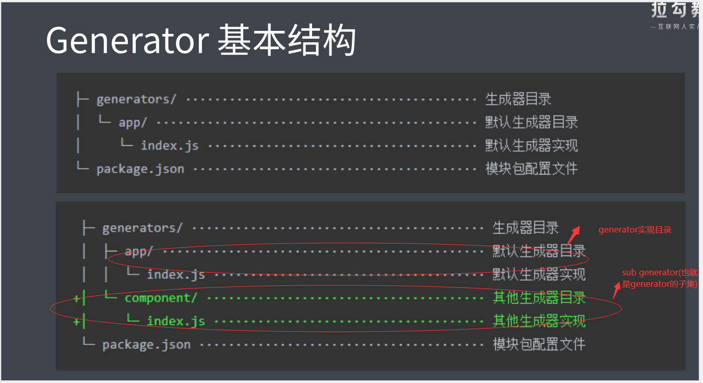

# 2. 脚手架工具 (前端工程化的发起者)

## 2.1 脚手架的本质作用

- 创建项目基础结构、提供项目规范和约定
  - 相同的组织结构
  - 相同的开发范式
  - 相同的模块依赖
  - 相同的工具配置
  - 相同的基础代码

举个例子
IDE 创建项目的过程就是一个脚手架的工作流程 (例如：Android Studio 创建安卓项目)

前端脚手架

- 前端脚手架不会集成在莫个 IDE 中，是以独立的工具存在，相对会复杂一些，本质上脚手架的目的都是一样的，都是为了解决在创建项目过程中那些复杂的工作。

## 2.2 常用的脚手架工具

创建项目的脚手架工具

- React.js 项目 -> create-react-app
- Vue.js 项目 -> vue-cli
- Angular 项目 -> angular-cli
  上面这些工具实现都大同小异，无外乎都是根据信息创建对应的项目基础结构,只适用于自身服务的那个框架的项目

- Yeoman 通用性脚手架工具

在项目开发过程中创建一些特定类型的文件

- Plop
  - 例如创建一个组件 / 模块所需要的文件

### 2.2.1 Yeoman

通用性的项目脚手架工具，他可以根据模板生成一个对应的项目结构，这种脚手架一般都很灵活，很容易扩展

Yeoman 作为最老牌，最强大，最通用的一款脚手架工具，他有更多值得我们借鉴学习的地方

Yeoman 优点：

- Yeoman 可以搭配不同的 generator 去创建任何类型的项目，也就是说我们可以通过创建自己的 generator 从而去定制属于我们的自己前端脚手架，如下图所示


Yeoman 缺点：在很多专注框架开发的人眼中 Yeoman 过于通用不够专注所以他们更喜欢使用像 vue-cli 这种的脚手架

Yeoman 基本使用

- 在全局范围安装 yo

```js
npm install yo --global # or  yarn global add yo
```

- 安装对应的 generator

```js
npm install generator-node --global # or  yarn global add generator-node
```

- 通过 yo 运行 generator

```js
cd path/to/project-dir
mkdir lyk-my-module
yo node   // node_12以上不支持该命令了outgoingMessage._headers, outgoingMessage._headerNames
```


### 2.2.1.1 Yeoman 的 Sub Generator
在已有项目基础上创建一些特殊类型的文件

使用 generator-node 提供的一个子集生成器叫 cli的生成器去帮我们生成一个叫 cli 应用所需要的文件，让我们这个模块变成 cli 应用

``` js
// 在上一个my-module项目中运行如下命令创建generator的子集
yo node:cli
// 使用 yarn link 将这个模块作为全局的命令行模块去运行了
yarn link 
```
需要注意的是并不是每个generator都提供子集,通过generator官方文档来去明确这个generator下面有没有子集的生成器  (例如：[generator-node的子集](https://github.com/yeoman/generator-node))

### 2.2.1.2 Yeoman 常规使用步骤

1. 明确你的需求；
2. 找到合适的 Generator;            generator-node
3. 全局范围安装找到的 Generator;    yarn global add generator-node
4. 通过 Yo 运行对应的 Generator;    yo node
5. 通过命令行交互填写选项;          
6. 生成你所需要的项目结构；

### 2.2.1.3 自定义 Generator

基于 Yeoman 搭建自己的脚手架

### 2.2.1.4 创建 Generator 模块
Generator 本质上是一个 NPM 模块

Generator 基本结构


### 2.2.2 Plop

一个小而美的脚手架工具

作用: 在项目开发过程中创建一些特定类型的文件 (例如创建一个组件 / 模块所需要的文件)

Polp 的具体使用

- 将 plop 模块作为项目开发依赖安装
- 在项目根目录下创建一个 plopfile.js 文件
- 在 plopfile.js 文件中定义脚手架任务
- 编写用于生成特定类型文件的模板
- 通过 plop 提供的 cli 运行脚手架任务

脚手架的工作原理

## 2.3 通用脚手架工具剖析

## 2.4 开发一款脚手架
