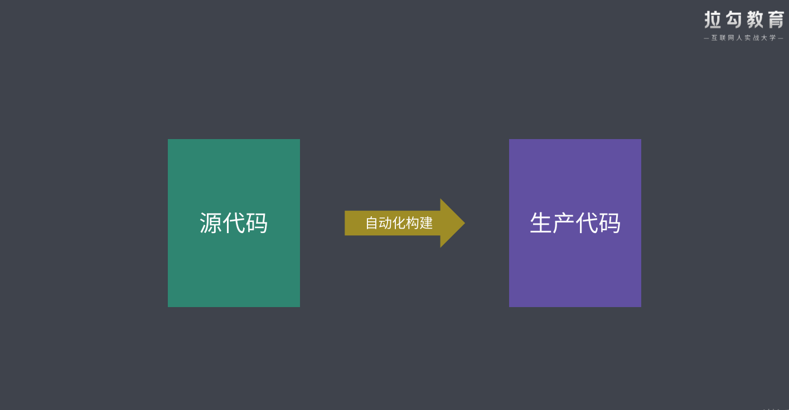
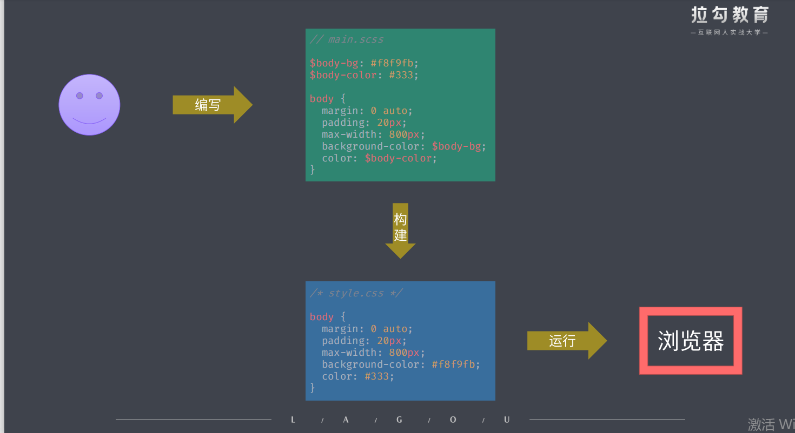
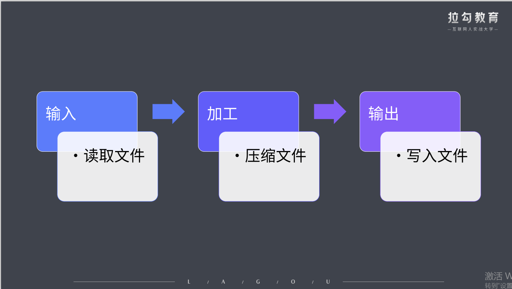
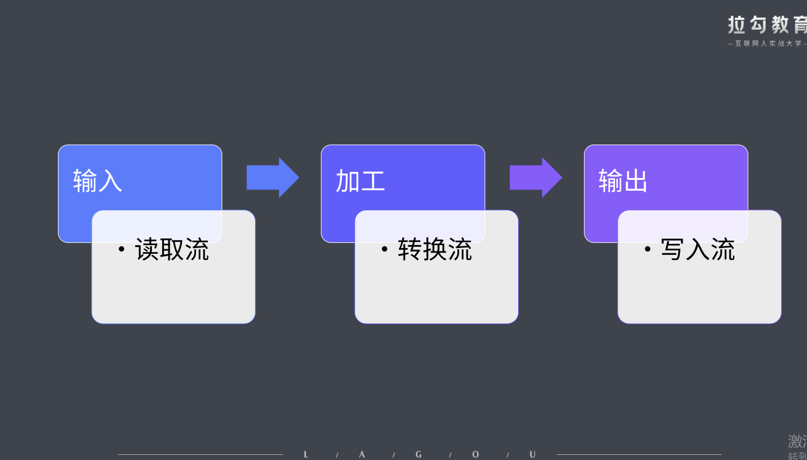

# 3. 自动化构建

一切重复工作本应自动化

自动化

自动化构建


自动化构建工具流

自动化构建初体验

- 正常编写 css 运行在浏览器中
  

- 编写 less 文件，通过自动化构建将 less 转换成浏览器认识的 css 文件
  

NPM Scripts

- 实现自动化构建工作流的最简方式

常用的自动化构建工具

- Grunt
- Gulp
- FIS

## 3.1 Grunt

基本使用

```js
// 步骤1  安装 grunt 模块
yarn add grunt -D
// 步骤2  添加 gruntfile.js 文件, 是入口文件，在这里实现你的意图。  (相当于webpack的webpack.config.js)
mkdir gruntfile.js
// 步骤3  在 gruntfile.js 文件中编写自己的配置
// 3.1) grunt默认导出一个函数，此函数接收一个 grunt 的对象类型的形参, grunt 对象中提供一些创建任务时会用到的 API
// 3.2) grunt.initConfig 是为任务添加一些配置选项
// 3.3) grunt.registerTask 是注册任务，通过这些任务实现你自己的功能
// 3.3.1) default是默认任务名称，通过 grunt 执行时可以省略任务名    yarn grunt
// 3.3.2) 其他任务名称执行， 使用 yarn grunt 任务名 去运行
// 3.3.3) 在注册的任务中可以通过 grunt.config(任务名) 拿到 grunt.initConfig中的配置选项
module.exports = (grunt) => {
  // grunt.initConfig() 用于为任务添加一些配置选项
  grunt.initConfig({
    // 键一般对应任务的名称
    // 值可以是任意类型的数据
    task1: {
      name: "我是任务1",
    },
  });

  // 注册默认任务 default
  // 通过 grunt 执行时可以省略          yarn grunt
  grunt.registerTask("default", () => {
    console.log("default task");
  });

  // 注册task1任务              yarn grunt task1
  grunt.registerTask("task1", () => {
    // 任务中可以使用 grunt.config() 获取配置
    console.log(grunt.config("task1"));
    // 如果属性值是对象的话，config 中可以使用点的方式定位对象中属性的值
    console.log(grunt.config("task1.name"));
  });
};

```

注册同步任务和异步任务，以及任务内部使用其他任务的使用如下所示

```js
// 默认导出一个函数， 函数有个形参 grunt, grunt 对象中提供一些创建任务时会用到的 API

module.exports = (grunt) => {
  // 注册任务1
  grunt.registerTask("task1", () => {
    console.log("我是任务1");
  });
  // 注册任务2
  grunt.registerTask("task2", () => {
    console.log("我是任务2");
  });
  // grunt.registerTask
  // 第一个参数是任务名
  // 第二个参数是实例任务  可以是字符串也可以是数组，还可以是函数
  // 第三个参数可以是函数，也可以不存在

  // 注册默认任务         通过 yarn grunt 执行
  // 第二个参数是函数，执行这个任务的时候会直接执行这个函数
  grunt.registerTask("default", () => {
    console.log("我是默认任务");
  });
  // 输出   我是默认任务

  // 这种情况和上面的是一样的
  grunt.registerTask("default", "task11", () => {
    console.log("我是默认任务");
  });
  // 输出   我是默认任务

  // 第二个参数是字符串，会执行此字符串的任务
  grunt.registerTask("default", "task1"); // 执行task1任务
  // 输出  我是任务1

  // 第二个参数是数组    这里映射的任务会按顺序依次执行，不会同步执行
  grunt.registerTask("default", ["task1", "task2"]); // 执行task1任务
  // 输出
  // 我是任务1
  // 我是任务2

  // 也可以在任务函数中执行其他任务     (grunt.task.run)
  grunt.registerTask("task3", () => {
    // task1 和 task2 会在当前任务执行完成过后自动依次执行
    grunt.task.run("task1", "task2");
    console.log("current task runing~");
  });
  // 输出
  // current task runing~
  // 我是任务1
  // 我是任务2

  // 注册异步任务
  // 默认 grunt 采用同步模式编码
  // 如果需要异步可以使用 this.async() 方法创建回调函数
  // 由于函数体中需要使用 this，所以这里不能使用箭头函数
  grunt.registerTask("async-task", function () {
    const done = this.async();
    setTimeout(() => {
      console.log("async task working~");
      done();
    }, 3000);
  });
  // 过3秒输出
  // async task working~
};
```

通过上述总结出

- 注册的任务如果一样的话，后面注册的会覆盖前面注册的任务
- 注册的默认任务通过 yarn grunt 执行，注册的其他任务通过 yarn grunt 任务名 去执行
- 注册任务指定的第二个参数如果是字符串或者数组的话,第三个参数并且不是一个函数的话，如果没有找到第二个参数的任务会报错
- 可以在任务内部使用 grunt.task.run 执行其他任务，其他任务在此任务结束之后执行
- 默认 grunt 采用同步模式编码, 如果需要异步可以使用 this.async() 方法创建回调函数，并且函数体中不能使用箭头函数

标记任务失败

```js
module.exports = (grunt) => {
  // 执行任务失败的几种方式

  // 同步任务函数执行过程中返回false就意味着任务执行失败
  grunt.registerTask("task1", () => {
    console.log("run task1");
    return false;
  });
  grunt.registerTask("task2", () => {
    console.log("run task2");
  });
  // 如果一个任务列表中的某个任务执行失败
  // 则后续任务默认不会运行
  // 除非 grunt 运行时指定 --force 参数强制执行
  grunt.registerTask("default", ["task1", "task2"]);
  // 使用 yarn grunt    输出如下
  // run task1
  // 报错
  // 使用 yarn grunt --force  输出如下
  // run task1
  // run task2

  // 异步函数中标记当前任务执行失败的方式是为回调函数指定一个 false 的实参
  grunt.registerTask("bad-async", function () {
    const done = this.async();
    setTimeout(() => {
      console.log("async run bad-async~");
      done(false); // 标记任务失败
    }, 1000);
  });
  // 输出如下
  // async run bad-async~
  // 报错
};
```

通过上述所得:

- 同步任务 return false 就代表此任务失败
- 如果一个任务列表中的某个任务执行失败，则后续任务默认不会运行，除非 grunt 运行时指定 --force 参数强制执行
- 异步函数中标记当前任务执行失败的方式是为回调函数指定一个 false 的实参

配置选项方法 和 多目标任务

```js
module.exports = (grunt) => {
  // 多目标模式，可以让任务根据配置形成多个子任务
  grunt.initConfig({
    dev: {
      foo: 100,
      bar: "456",
    },
    build: {
      options: {
        msg: "task options",
      },
      foo: {
        options: {
          msg: "foo target options",
        },
      },
      bar: "456",
    },
  });
  // 根据dev配置的几个选项就执行几个子任务
  // this.target 是子任务名称  foo/bar
  // this.data 是子任务的数据   100/456
  grunt.registerMultiTask("dev", function () {
    console.log(`task: dev, target: ${this.target}, data: ${this.data}`);
  });
  // 输出
  // Running "dev:foo" (dev) task
  // task: dev, target: foo, data: 100
  // Running "dev:bar" (dev) task
  // task: dev, target: bar, data: 456

  // this.options拿到的就是子任务配置的options
  // 如果子任务没有options就拿最顶层的options配置
  grunt.registerMultiTask("build", function () {
    console.log(this.options());
  });
  // 输出
  // Running "build:foo" (build) task
  // { msg: 'foo target options' }
  // Running "build:bar" (build) task
  // { msg: 'task options' }
};
```

综上所得：

- 多目标模式，可以让任务根据配置形成多个子任务， 使用 grunt.registerMultiTask 注册多任务模式，并且可以拿到子任务的配置（例如：data 和 options）

插件的使用

- grunt 的插件都是以 grunt-开头的插件 （例如：grunt-babel,grunt-sass,grunt-contrib-watch）

```js
// 1. 安装所需的插件
yarn add grunt 	-D              // grunt插件
yarn add load-grunt-tasks -D    // 自动加载所有的 grunt 插件中的任务
yarn add grunt-babel @babel/core @babel/preset-env -D // 安装babel插件用来解析js文件
yarn add grunt-sass sass	-D      // 安装sass插件用来解析sass文件
yarn add grunt-contrib-watch -D  // watch的使用会自动监听修改，并grunt自动构建

// 2. 配置 gruntfile.js 文件
// 默认导出一个函数， 函数有个形参 grunt, grunt 对象中提供一些创建任务时会用到的 API

const sass = require("sass"); // 引入sass模块
const loadGruntTasks = require("load-grunt-tasks"); // 使用这个插件自动加载已grunt-开头的所有任务插件
module.exports = (grunt) => {
  // 初始化任务配置
  grunt.initConfig({
    // 初始化 sass 任务配置
    sass: {
      options: {
        sourceMap: true, // 生成 soureceMap 映射文件
        implementation: sass, // 实现方式       使用sass解析
      },
      main: {
        files: {
          // 输出:输入
          "dist/css/main.css": "src/scss/main.scss",
        },
      },
    },
    // 使用babel插件解析js
    babel: {
      options: {
        sourceMap: true, // 生成 soureceMap 映射文件
        presets: ["@babel/preset-env"], // 使用preset-env 解析es6+最新语法
      },
      main: {
        files: {
          // 输出:输入
          "dist/js/app.js": "src/js/app.js",
        },
      },
    },
    // watch的使用会自动监听修改，并grunt自动构建
    watch: {
      js: {
        // files表示要监听的文件，可以是单个值或数组；tasks表示监听有改动后要执行什么任务
        files: ["src/js/*.js"],
        tasks: ["babel"],
      },
      css: {
        files: ["src/scss/*.scss"],
        tasks: ["sass"],
      },
    },
    //html 压缩
    htmlmin: {
      options: {
        removeComments: true,
        removeCommentsFromCDATA: true,
        collapseWhitespace: true,
        collapseBooleanAttributes: true,
        removeAttributeQuotes: true,
        removeRedundantAttributes: true,
        useShortDoctype: true,
        removeEmptyAttributes: true,
        removeOptionalTags: true,
      },
      build: {
        expand: true,
        cwd: "./src",
        src: ["*.html"],
        dest: "./dist",
      },
    },
  });

  // 自动加载所有的 grunt 插件中的任务
  // 代替下面手动加载任务插件的使用
  loadGruntTasks(grunt);

  // 加载npm模块任务  (插件)
  //   grunt.loadNpmTasks("grunt-sass"); // 会注册一个sass任务
  //   grunt.loadNpmTasks("grunt-babel"); // 会注册一个babel任务
  //   grunt.loadNpmTasks("grunt-contrib-watch"); // 会注册一个watch任务
  //   grunt.loadNpmTasks("grunt-contrib-htmlmin"); // 会注册一个htmlmin任务

  grunt.registerTask("default", ["sass", "babel", "htmlmin"]);
  //   grunt.registerTask("default", ["sass", "babel", "htmlmin","watch"]);
};
```

综上所得：

- 我们要使用什么插件就去网上找 [grunt 插件](https://www.gruntjs.net/plugins)的使用
- 然后在 grunt.intiConfig 中配置 grunt 插件所需要的参数
- 然后在加载进来这些插件模块
- 最后注册任务使用这些插件(任务)
- [网上 grunt 插件的使用](https://www.cnblogs.com/haogj/p/4898349.html)
- [grunt 自动化构建](https://www.cnblogs.com/imwtr/p/4668186.html)

文件路劲的处理

实现常用的构建任务

## 3.2 Gulp

基本使用

```js
// 1. 安装 gulp
yarn add gulp -D
// 2. 创建 gulpfile.js 文件，配置gulp
// 导出的函数都会作为 gulp 任务
// gulp 的任务函数都是异步的
exports.task1 = (done) => {
  console.log("run task1");
  done(); // 标识任务执行完成
};

// default 是默认任务
// 在运行是可以省略任务名参数
exports.default = (done) => {
  console.log("run default");
  done();
};

// v4.0 之前需要通过 gulp.task() 方法注册任务
// const gulp = require("gulp");
// gulp.task("task2", (done) => {
//   console.log("run task2");
//   done();
// });
```

综上所得：

- gulp 导出的函数都会作为 gulp 的任务
- gulp 区别于 grunt 的是它所有的任务函数都是异步的，函数有个形参 done，done 执行标识任务执行完成
- yarn gulp 任务名(默认任务可以省略名称)

创建组合任务

- series 执行串行任务
- parallel 执行并行任务

```js
// 导出的函数都会作为 gulp 任务
// gulp 的任务函数都是异步的

// 2. gulp 组合任务的使用
const { series, parallel } = require("gulp");

// 创建任务1
const task1 = (done) => {
  console.log("run task1");
  done();
};

// 创建任务2
const task2 = (done) => {
  setTimeout(() => {
    console.log("run task2");
    done();
  }, 1000);
};

// 创建任务3
const task3 = (done) => {
  console.log("run task3");
  done();
};

// 创建串行任务队列
exports.seriesTask = series(task1, task2, task3);
// 执行 yarn gulp seriesTask 输入如下
// [17:05:22] Starting 'seriesTask'...
// [17:05:22] Starting 'task1'...
// run task1
// [17:05:22] Finished 'task1' after 1.96 ms
// [17:05:22] Starting 'task2'...
// run task2
// [17:05:23] Finished 'task2' after 1.01 s
// [17:05:23] Starting 'task3'...
// run task3
// [17:05:23] Finished 'task3' after 2.98 ms
// [17:05:23] Finished 'seriesTask' after 1.04 s

// 创建并行任务队列
exports.parallelTask = parallel(task1, task2, task3);
// 执行 yarn gulp parallelTask
// [17:06:29] Starting 'parallelTask'...
// [17:06:29] Starting 'task1'...
// [17:06:29] Starting 'task2'...
// [17:06:29] Starting 'task3'...
// run task1
// [17:06:29] Finished 'task1' after 3.54 ms
// run task3
// [17:06:29] Finished 'task3' after 4.25 ms
// run task2
// [17:06:30] Finished 'task2' after 1.01 s
// [17:06:30] Finished 'parallelTask' after 1.04 s
```

通过上面代码得出：

- series 串行任务是一个任务执行完，再执行后面的任务
- parallel 并行任务是一起执行

异步任务的三种方式，如下代码所示:

```js
// 3. gulp 异步任务的几种方式

// 3.1 done方式
exports.callback = (done) => {
  console.log("run callback");
  done(); // 标识任务执行完成
};

exports.callback_error = (done) => {
  console.log("run callback_error");
  done(new Error("callback_error failed"));
};

// 3.2 promise方式
exports.promise = () => {
  console.log("run promise");
  return Promise.resolve();
};
exports.promise_error = () => {
  console.log("run promise_error");
  return Promise.rejecgt(new Error("promise_error failed"));
};

// 3.3 async+await方式
const timeout = (time) => {
  return new Promise((resolve) => {
    setTimeout(resolve, time);
  });
};
exports.async = async () => {
  await timeout(1000);
  console.log("run async");
};
```

构建过程核心工作原理



流式构建系统



```js
// 3. gulp 构建过程

const fs = require("fs"); // 引入node的fs核心模块
const { Transform } = require("stream"); // 引入node的strem核心模块

exports.default = () => {
  // 创建文件读取流
  const readStream = fs.createReadStream("normalize.css");

  // 创建文件写入流
  const writeStream = fs.createWriteStream("normalize.min.css");

  // 创建文件转换流
  const transformStream = new Transform({
    // 核心转换过程
    // 在此对读取流文件进行逻辑操作   (例如：css,js,html文件压缩，es6+转换成es5等等)
    transform: (chunk, encoding, callback) => {
      const input = chunk.toString(); // 获取读取的文件
      // 去除掉input内容的空格和注释
      const output = input.replace(/\s+/g, "").replace(/\/\*.+?\*\//g, "");
      callback(null, output);
    },
  });

  // 通过pipe管道将一个流输入到另外一个流
  return readStream
    .pipe(transformStream) // 转换
    .pipe(writeStream); // 写入

  // 最后当读取流读取完成内部会执行done方法来标识任务完成
  // read.on('end', () => {
  //     done()
  //   })
};
```

文件操作 API + 插件的使用

```js
// 1. 安装需要的模块
yarn add gulp -D          // gulp模块
yarn add gulp-clean-css -D  // 压缩css的gulp插件    (都是转换流)
yarn add gulp-rename -D   // 文件重命名的gulp插件   (都是转换流)

// 2. 创建 gulpfile.js 文件 配置gulp
// 3. 使用 gulp 对文件操作的API + 插件的使用
const { src, dest } = require("gulp");
const cleanCss = require("gulp-clean-css"); // 压缩css的插件
const rename = require("gulp-rename"); // 文件重命名

exports.default = () => {
  return src("src/*.css") // 读取流
    .pipe(cleanCss()) // 压缩css
    .pipe(rename({ extname: ".min.css" })) // 修改文件后缀名
    .pipe(dest("dist")); // 输入流
};
```

综上所得：

- gulp 提供了对文件操的 API src(读取流) dest(写入流)
- gulp 提供的插件都是转换流可以通过 pipe 管道传递流

[Gulp 入门](https://juejin.im/post/593cf6efac502e006b3e2bc0)
[Gulp 常用插件 1](https://www.cnblogs.com/jiaoshou/p/12040144.html)
[Gulp 常用插件 2](https://www.cnblogs.com/jiaoshou/p/12003709.html)

Gulp 自动化构建案例

- 前期安装插件

```js
yarn add gulp -D    // gulp核心插件
yarn add gulp-load-plugins -D   // 自动加载 package.json 中的 gulp 插件，避免一个个require插件
```

- 样式文件编译任务

```js
// 1. 安装插件
yarn add gulp-sass -    // 编译 sass
// 2. 样式编译的任务
const style = () => {
    return src('src/assets/styles/*.scss', { base: 'src' })
        .pipe(plugins.sass({ outputStyle: 'expanded' }))
        .pipe(dest('dist'));
}
```

- 脚本文件编译任务

```js
// 1. 安装插件
yarn add gulp-babel -D      // 使用 babel 编译 JS 文件
yarn add @babel/core @babel/preset-env @babel/plugin-proposal-class-properties -D    // babel的辅助插件
// 2. 脚本编译的任务
const script = () => {
    return src("src/assets/scripts/*.js", { base: "src" })
        .pipe(plugins.babel({ presets: ["@babel/preset-env"], plugins: ["@babel/plugin-proposal-class-properties"] }))  // webpack的babel配置
        .pipe(dest("dist"));
}

```

- 页面模板文件编译任务

```js
// 1. 安装插件
yarn add gulp-swig -D   // swig 一个简单的，强大的，可扩展的JavaScript模板引擎。
yarn add bootstrap jquery popper.js // 辅助index.html页面布局的插件

// 2. 页面模板的编译的任务
const page = () => src('src/*.html', { base: 'src' })
    .pipe(plugins.swig({ data, defaults: { cache: false } })) // 防止模板缓存导致页面不能及时更新
    .pipe(dest('dist'))
```

- 图片和字体文件的转换

```js
// 1. 安装插件
yarn add gulp-imagemin -D // 压缩jpg、png、gif等图片的gulp插件
// 2.图片编译的任务
const image = () =>
  src("src/assets/images/**", { base: "src" })
    .pipe(plugins.imagemin())
    .pipe(dest("dist"));

// 3.字体编译的任务
const font = () =>
  src("src/assets/fonts/**", { base: "src" })
    .pipe(plugins.imagemin())
    .pipe(dest("dist"));
```

- 其他文件及文件清除

```js
// 1. 安装插件
yarn add del  -D  // 清除目录
// 2. 移除打包目录的任务
const clean = () => del(["dist"]);
// 3.额外文件的任务(原封不动拷贝过去)
const extra = () => src("public/**", { base: "public" }).pipe(dest("dist"));
```

- 自动加载插件

```js
// 1. 安装插件
yarn add gulp-load-plugins -D   // 自动加载 package.json 中的 gulp 插件，避免一个个require插件
// 2. 使用插件
const loadPlugins = require("gulp-load-plugins"); // 自动加载 package.json 中的 gulp 插件，避免一个个require插件
const plugins = loadPlugins(); // plugins的属性就是page.json中的gulp插件
// plugins.插件名
```

- 热更新开发服务器

```js
// 1. 安装插件
yarn add browser-sync -D        // 开发服务器
// 2. 热更新开发服务器的任务
const server = () => {
  // 初始化服务器的配置
  bs.init({
    port: 2080,
    open: false, // 是否打开浏览器
    server: {
      // 以哪个目录为静态服务器的目录   (从左往右依次查找资源)
      // dist   打包之后的目录  (上线的代码)
      // src    源代码目录      (开发的代码)
      // public 静态资源目录    (开发上线都需要的代码)
      baseDir: ["dist", "src", "public"],
      // 路由映射   为了解决打包后的文件引用不到node_modules中的模块 (/node_modules/bootstrap/dist/css/bootstrap.css)
      routes: {
        "/node_modules": "node_modules",
      },
    },
  });
};
```

通过上面的配置的服务器只是静态服务器，style script page image font 的 变化之后还是之前的展示的内容，不是最新修改的内容，为了解决上面的问题需要用到 gulp 的 watch 来监听文件的变化来触发指定的任务重新编译文件，达到实时编译预览的效果。

- 监视变化以及构建过程优化

```js
// 1. 引入watch
const { src, dest, watch } = require("gulp");

// 样式编译的任务
const style = () =>
  src("src/assets/styles/*.scss", { base: "src" })
    .pipe(plugins.sass({ outputStyle: "expanded" })) // webpack的sass配置
    .pipe(dest("dist"))
    .pipe(bs.reload({ stream: true })); // bs以流的形式重新加载一下

// 脚本编译的任务
const script = () =>
  src("src/assets/scripts/*.js", { base: "src" })
    .pipe(
      plugins.babel({
        presets: ["@babel/preset-env"],
        plugins: ["@babel/plugin-proposal-class-properties"],
      })
    ) // webpack的babel配置
    .pipe(dest("dist"))
    .pipe(bs.reload({ stream: true })); // bs以流的形式重新加载一下

// 页面模板的编译的任务
const page = () =>
  src("src/*.html", { base: "src" })
    .pipe(plugins.swig({ data: dataConfig.data, defaults: { cache: false } })) // 防止模板缓存导致页面不能及时更新
    .pipe(dest("dist"))
    .pipe(bs.reload({ stream: true })); // bs以流的形式重新加载一下

// 热更新开发服务器的任务
const server = () => {
  // 2. 监听指定的文件变化，变化之后找对应的任务重新编译生成最新的文件，并且对应的任务需要bs.reload重新加载一下，不然看不到效果
  watch("src/assets/styles/*.scss", style);
  watch("src/assets/scripts/*.js", script);
  watch("src/*.html", page);

  // 图片和字体以及静态资源就不需要重新执行对应的任务了
  // 因为他们仅仅只是拷贝过去和压缩，没有对其进行特殊的操作，所以不需要执行对应的任务，只需要bs.reload一下就可以了
  // 开发环境可以使用src的资源
  // 生产环境，执行一下对应的任务，然后使用dist打包之后的资源
  watch(
    ["src/assets/images/**", "src/assets/fonts/**", "public/**"],
    bs.reload
  );

  // 初始化服务器的配置
  bs.init({
    port: 2080,
    open: false, // 是否打开浏览器
    server: {
      // 以哪个目录为静态服务器的目录   (从左往右依次查找资源)
      // dist   打包之后的目录  (上线的代码)
      // src    源代码目录      (开发的代码)
      // public 静态资源目录    (开发上线都需要的代码)
      baseDir: ["dist", "src", "public"],
      // 路由映射   为了解决打包后的文件引用不到node_modules中的模块 (/node_modules/bootstrap/dist/css/bootstrap.css)
      routes: {
        "/node_modules": "node_modules",
      },
    },
  });
};
```

- useref 文件引用处理

  [gulp-userref 的使用例子](https://www.cnblogs.com/jiaoshou/p/12040144.html)

```js
// 1. 安装插件
yarn add gulp-useref -D   // 将HTML引用的多个CSS和JS合并起来，减小依赖的文件个数，从而减少浏览器发起的请求次数。
// 2. useref任务: (将HTML引用的多个CSS和JS合并起来，减小依赖的文件个数，从而减少浏览器发起的请求次数。)
// gulp-useref根据注释将HTML中需要合并压缩的区块找出来，对区块内的所有文件进行合并。
// html中的注释格式如下
// <!-- build:css assets/styles/vendor.css -->
// <link rel="stylesheet" href="/node_modules/bootstrap/dist/css/bootstrap.css">
// <!-- endbuild -->
const useref = () =>
  src("dist/*.html", { base: "dist" })
    .pipe(plugins.useref({ searchPath: ["dist", "."] }))
    .pipe(dest("dist"));
```

上面是在 gulpfile.js 中的调用代码，但是还需要在 HTML 写一些代码配合使用，下面我们就来看看在 html 中需要怎么配合使用。

```html
<!-- build:<type>(alternate search path) <path> <parameters> -->
... HTML Markup, list of script / link tags.
<!-- endbuild -->
```

> - type (键入): 可以是 js ，css 或 remove ; remove 将完全删除构建块，而不会生成文件
> - alternate search path (替代搜索路径):（可选）默认情况下，输入文件是相对于已处理文件的。替代搜索路径允许更改此路径。该路径还可以包含使用
>   JSON 大括号数组表示法（例如）从右到左处理的一系列路径<!-- build:js({path1,path2}) js/lib.js -->。
> - path: 优化文件的文件路径，目标输出
> - parameters(参数): 应该添加到标签中的其他参数

完整形式的示例如下所示：

```html
<!-- build:css assets/styles/vendor.css -->
<link rel="stylesheet" href="/node_modules/bootstrap/dist/css/bootstrap.css" />
<!-- endbuild -->
<!-- build:css assets/styles/main.css -->
<link rel="stylesheet" href="assets/styles/main.css" />
<!-- endbuild -->
```

生成的 HTML 将是：

```html
<link rel="stylesheet" href="assets/styles/vendor.css" />
<link rel="stylesheet" href="assets/styles/main.css" />
```

- 分别压缩 HTML、CSS、JavaScript

```js
// 1. 安装
yarn add gulp-htmlmin -D  // 压缩html
yarn add gulp-clean-css -D  // 压缩css
yarn add gulp-uglify -D   // 压缩js
yarn add gulp-if -D   // 如果要压缩或执行其他一些修改，则可以使用 gulp-if 有条件地处理特定类型的资产。

// 2. 使用useref将HTML引用的多个CSS和JS合并起来之后 再压缩 html,css,js
const useref = () =>
  src("dist/*.html", { base: "dist" })
    .pipe(plugins.useref({ searchPath: ["dist", "."] }))
    // 这里执行压缩css,js的代码
    .pipe(plugins.if(/\.js$/, plugins.uglify())) // 压缩js
    .pipe(plugins.if(/\.css$/, plugins.cleanCss())) // 压缩css
    .pipe(
      plugins.if(
        /\.html$/,
        plugins.htmlmin({
          // 压缩html
          collapseWhitespace: true, // 去掉空格
          minifyCSS: true, // 小型css
          minifyJS: true, // 小型js
        })
      )
    )
    .pipe(dest("dist"));

// 3. 通过上述使用 yarn gulp server的时候，如果重新修改html,css,js就会重新执行对应的任务进行编译，编译之后的文件又会替换调上面useref合并和压缩插件之后的文件，为了解决上面的问题，我们在开发(开发环境)的时候把编译之后的html,css,js的存到temp目录上,等到打包合并和压缩阶段(生产环境)再将temp目录编译到dist。需要改的代码如下所示


// 移除打包目录的任务
const clean = () => del(["temp", "dist"]);      // 1. 清空目录的时候多加个temp目录

// 样式编译的任务
const style = () =>
  src("src/assets/styles/*.scss", { base: "src" })
    .pipe(plugins.sass({ outputStyle: "expanded" }))
    .pipe(dest("temp"))                     // 2. 将style输出到temp中
    .pipe(bs.reload({ stream: true }));

// 脚本编译的任务
const script = () =>
  src("src/assets/scripts/*.js", { base: "src" })
    .pipe(
      plugins.babel({
        presets: ["@babel/preset-env"],
        plugins: ["@babel/plugin-proposal-class-properties"],
      })
    )
    .pipe(dest("temp"))          // 3. 将js输出到temp中
    .pipe(bs.reload({ stream: true }));

// 页面模板的编译的任务
const page = () =>
  src("src/*.html", { base: "src" })
    .pipe(plugins.swig({ data: dataConfig.data, defaults: { cache: false } }))
    .pipe(dest("temp"))      // 4. 将html输出到temp中
    .pipe(bs.reload({ stream: true }));

// 热更新开发服务器的任务
const server = () => {
  watch("src/assets/styles/*.scss", style);
  watch("src/assets/scripts/*.js", script);
  watch("src/*.html", page);
  watch(
    ["src/assets/images/**", "src/assets/fonts/**", "public/**"],
    bs.reload
  );

  // 初始化服务器的配置
  bs.init({
    port: 2080,
    open: false,
    server: {
      baseDir: ["temp", "src", "public"], // 5. 开发环境的时候使用temp目录的js,css,html
      routes: {
        "/node_modules": "node_modules",
      },
    },
  });
};

// 合并并且压缩文件
const useref = () =>
  // 6. 生成环境将temp目录的文件进行合并压缩编译到dist目录
  src("temp/*.html", { base: "temp" })
    .pipe(plugins.useref({ searchPath: ["temp", "."] }))
    .pipe(plugins.if(/\.js$/, plugins.uglify()))
    .pipe(plugins.if(/\.css$/, plugins.cleanCss()))
    .pipe(
      plugins.if(
        /\.html$/,
        plugins.htmlmin({
          collapseWhitespace: true,
          minifyCSS: true,
          minifyJS: true,
        })
      )
    )
    .pipe(dest("dist"));
```

- 重新规划构建过程

```js
// 1. 我们开发的时候会分开发环境和生成环境
// 并行编译css,js,html的任务
const compile = parallel(style, script, page);

// 1.1. 配置开发环境     (串行任务)
// 1. 把css,js,html编译成浏览器支持的语法
// 2. 开启静态服务器运行项目
const dev = series(clean, compile, server);

// 1.2 配置生产环境     (串行任务执行)
// 1. 先把之前打包的目录删除
// 2. 并行处理以下任务
// 2.1 把css,js,html编译成浏览器支持的语法，然后合并html中引入的资源，以及压缩css,js,html    这个是并行的任务
// 2.2 将图片和字体压缩一下放到打包目录
// 2.3 把静态资源拷贝到打包目录
const build = series(
  clean,
  parallel(series(compile, useref), image, font, extra)
);

module.exports = {
  dev,
  build,
};

// 2. 最后在packpage.json 中配置脚本
// yarn dev -> yarn gulp dev
// yarn build -> yarn gulp build
"scripts": {
  "dev": "yarn gulp dev",
  "build": "yarn gulp build"
}
```

[gulp构建项目](https://blog.csdn.net/guang_s/article/details/84673204)

- 使用watch实现按需刷新
``` js
// 样式编译的任务
const style = doneOrFileName => {
  console.log("styleFileName", doneOrFileName);
  // fileName默认是done函数就编译"src/assets/styles/*.scss"，如果是字符串就代表watch监听的莫个文件("src/assets/styles/index.scss")改变了,按需更新
  let fileName = typeof (doneOrFileName) === "string" ? doneOrFileName : "src/assets/styles/*.scss";
  return src(fileName, { base: "src" })
    .pipe(plugins.sass({ outputStyle: "expanded" })) // webpack的sass配置
    .pipe(dest(serverPath))
    .pipe(bs.reload({ stream: true })); // bs以流的形式重新加载一下
}


// 脚本编译的任务
const script = doneOrFileName => {
  console.log("scriptFileName", doneOrFileName);
  // fileName默认是done函数就编译"src/assets/scripts/*.js"，如果是字符串就代表watch监听的莫个文件(src/assets/scripts/main.js)改变了,按需更新
  let fileName = typeof (doneOrFileName) === "string" ? doneOrFileName : "src/assets/scripts/*.js";
  return src(fileName, { base: "src" })
    .pipe(
      plugins.babel({
        presets: ["@babel/preset-env"],
        plugins: ["@babel/plugin-proposal-class-properties"],
      })
    ) // webpack的babel配置
    .pipe(dest(serverPath))
    .pipe(bs.reload({ stream: true })); // bs以流的形式重新加载一下
}


// 页面模板的编译的任务
const page = doneOrFileName => {
  console.log("pageFileName", doneOrFileName);
  // fileName默认是done函数就编译"src/*.html"，如果是字符串就代表watch监听的莫个文件(src\index.html)改变了,按需更新
  let fileName = typeof (doneOrFileName) === "string" ? doneOrFileName : "src/*.html";
  return src(fileName, { base: "src" })
    .pipe(plugins.swig({ data: dataConfig.data, defaults: { cache: false } })) // 防止模板缓存导致页面不能及时更新
    .pipe(dest(serverPath))
    .pipe(bs.reload({ stream: true })); // bs以流的形式重新加载一下
}

// 热更新开发服务器的任务
const server = () => {
  // 2. 监听指定的文件变化，变化之后找对应的任务重新编译生成最新的文件，并且对应的任务需要bs.reload重新加载一下，不然看不到效果
  // watch("src/assets/styles/*.scss").on("change", (fileName) => style(fileName));     // 使用次方式会造成scss内部引入的样式文件改变不会触发。
  watch("src/assets/styles/*.scss", style);
  watch("src/assets/scripts/*.js").on("change", (fileName) => script(fileName));
  watch("src/*.html").on("change", (fileName) => page(fileName));

  // 图片和字体以及静态资源就不需要重新执行对应的任务了
  // 因为他们仅仅只是拷贝过去和压缩，没有对其进行特殊的操作，所以不需要执行对应的任务，只需要bs.reload一下就可以了
  // 开发环境可以使用src的资源
  // 生产环境，执行一下对应的任务，然后使用dist打包之后的资源
  watch(
    ["src/assets/images/**", "src/assets/fonts/**", "public/**"],
    bs.reload
  );

  // 初始化服务器的配置
  bs.init({
    port: 2080,
    open: false, // 是否打开浏览器
    server: {
      // 以哪个目录为静态服务器的目录   (从左往右依次查找资源)
      // dist   打包之后的目录  (上线的代码)
      // src    源代码目录      (开发的代码)
      // public 静态资源目录    (开发上线都需要的代码)
      baseDir: [serverPath, "src", "public"], // 开发环境的时候使用temp目录的js,css,html
      // 路由映射   为了解决打包后的文件引用不到node_modules中的模块 (/node_modules/bootstrap/dist/css/bootstrap.css)
      routes: {
        "/node_modules": "node_modules",
      },
    },
  });
};
```
综上所得：是通过watch监听change方法来知道到底是哪个文件改变了，然后触发任务只编译改变的文件。

- 补充

封装自动化构建工作流   gulpfile复用的问题


- 提取 Gulpfile 到模块
``` js
// 目标 (提取一个可复用的自动化构建工作流) 创建一个模块，然后把这个模块发布到npm仓库上，最后在我们的项目中使用这个模块
// 1. 创建github项目  lyk-gulp-pages
// 2. 常见本地项目，并且推送到github远程仓库
// 2.1 安装全局脚手架   zce-cli是老师的脚手架
yarn global add zce-cli
zce init nm lyk-gulp-pages[项目名]  
// 2.2 将项目推送到github上
git init
git remote add origin https://github.com/lyka3156/lyk-gulp-pages.git
git status
git add .
git commit -m "feat: init"
git push -u origin master
// 3. 将gulp-build-demo创建的自动化构建流提取到lyk-gulp-pages项目中,在这个项目中我们去封装好这个工作流，把一些需要解决的问题都解决掉，这样我们就可以在多个项目中使用这个工作流了。
// 3.1 将gulp-build-demo中的gulpfile.js入口文件放到lyk-gulp-pages中的lib中的index.js文件中
// 3.2 将gulp-build-demo中的开发依赖模块拿过来做为lyk-gulp-pages的生产依赖 （***）
// 为什么不是放到开发依赖了。 因为你去安装lyk-gulp-pages这个模块，他会自动帮你安装生产依赖，不会安装开发依赖，开发依赖指的是你在开发我们这个模块需要安装的东西。
// 3.3 yarn 安装lyk-gulp-pages项目中的模块
// 4. 我们将gulp-build-demo中的gulpfile.js中的内容删掉,package.json中的开发依赖删掉，node_modules也删掉, 删完之后就是一个干净的项目
// 5. 使用lyk-gulp-pages去提供自动化构建的工作流
// 5.1 我们在lyk-gulp-pages模块还没完成需要本地调试，使用yarn link的方式link到全局中
yarn link
// 5.2 在gulp-build-demo中的yarn link的方式把lyk-gulp-pages项目拿过来放到node_modules中
yarn link "lyk-gulp-pages"
// 5.3 将lyk-gulp-pages导出的gulpfile.js作为当前gulpfile.js的入口文件
// gulp-build-deom的gulpfile.js
module.exports = require("lyk-gulp-pages"); 
// 5.4 在gulp-buld-demo中安装自己的依赖
yarn
// 5.5 这样我们gulp-buld-demo项目就可以跑了
yarn build  // 会提示没有gulp命令，需要安装gulp去执行,    （***）
// 在后续真正发布的时候就不会有这个问题了，因为你发布出去之后我们去安装lyk-gulp-pages模块的时候它会自动去安装gulp这个模块,gulp就会出现在node_modules中，所以就不会报错了。
yarn add gulp -D
```

- 解决模块中的问题
``` js
// 6. 抽取lyk-gulp-pages的公共配置
// 6.1 将lyk-gulp-pages中gulpfile.js中的data数据抽离成data.config.js引入进来
const path = require("path");
const cwd = process.cwd();
let dataConfig = {
  // defualt config
};
try {
  const loadConfig = require(path.join(cwd, "data.config.js"));
  dataConfig = { ...dataConfig, ...loadConfig };
} catch{
}
// 7. 将lyk-gulp-pages中引入的模块使用require方式引入
const script = doneOrFileName => {
  let fileName = typeof (doneOrFileName) === "string" ? doneOrFileName : "src/assets/scripts/*.js";
  return src(fileName, { base: "src" })
    .pipe(
      plugins.babel({
        presets: [require("@babel/preset-env")],  // 不使用字符串
        plugins: [require("@babel/plugin-proposal-class-properties")],  // 不使用字符串
      })
    )
    .pipe(dest(serverPath))
    .pipe(bs.reload({ stream: true }));
}
// 使用require会从当前目录开始往上找，使用字符串它会直接从node_modules下找
// 8. 再使用yarn build就可以打包目录了  这样我们gulpfile提取就ok了
```


- 抽象路劲配置
``` js
// 9. 在lyk-gulp-pages中把src,temp,dist，抽象成配置
// 9.1 lyk-gulp-pages
let dataConfig = {
  // defualt config
  build: {
    src: "src",
    dist: "dist",
    temp: "temp",
    public: "public",
    paths: {
      styles: "assets/styles/*.scss",
      scripts: "assets/styles/*.js",
      pages: "*.html",
      images: "assets/images/**",
      fonts: "assets/fonts/**"
    }
  }
};
// 9.2 在gulp-build-demo中添加配置
module.exports = {
   // 可以在这里自定义自己的目录配置
  build: {
    src: "src",
    dist: "dist",     
    temp: ".temp",   
    public: "public",
    paths: {
      styles: "assets/styles/*.scss",
      scripts: "assets/styles/*.js",
      pages: "*.html",
      images: "assets/images/**",
      fonts: "assets/fonts/**"
    }
  },
  data: {...}
}
```

- 包装 Gulp CLI
``` js
// 1. 创建cls的入口文件
mkdir bin/lyk-gulp-pages.js
// 2. 在pageage.json添加bin的配置
"bin": "bin/lyk-gulp-pages.js",
// 3. 在lyk-gulp-pages.js编写cls命令的脚本
#!/usr/bin/env node

// 1. 将工作目录设置为当前工作目录
process.argv.push("--cwd")
process.argv.push(process.cwd())

// 2. 将gulpfile.js文件的目录设置为gulpfile.js的入口目录(lib/index.js)
process.argv.push("--gulpfile")
// require.resolve("..") 找的是package.json的main(lib/index.js)
process.argv.push(require.resolve(".."))


console.log(process.argv);
// [
//     'C:\\Program Files\\nodejs\\node.exe',
//     'C:\\Users\\Administrator\\AppData\\Roaming\\npm\\node_modules\\lyk-gulp-pages\\bin\\lyk-gulp-pages.js',
//     'dev',
//     '--cwd',
//     'E:\\react-lgjy\\fed-e-task-part2-module1\\code\\task3-code\\gulp-build-demo',
//     '--gulpfile',
//     'E:\\react-lgjy\\fed-e-task-part2-module1\\code\\task3-code\\lyk-gulp-pages\\lib\\index.js'
// ]

// 3. 执行gulp命令
// 相当于执行 yarn gulp
require("gulp/bin/gulp")

// 4. 在gulp-build-demo 中使用 cli就行了

lyk-gulp-pages build
// 5. 通过上面3和4所得
lyk-gulp-pages build 对应 => yarn gulp build --gulpfile E:\\react-lgjy\\fed-e-task-part2-module1\\code\\task3-code\\lyk-gulp-pages\\lib\\index.js' --cwd E:\\react-lgjy\\fed-e-task-part2-module1\\code\\task3-code\\gulp-build-demo

```
- 发布并使用模块   [npm常用命令](https://www.cnblogs.com/leinov/p/9658110.html)
``` js
// 1. 在package.json中在加工bin目录发布上去
{
  "files": [
    "lib",
    "bin"
  ],
}
// 2. 先通过git提交到远程仓库
// 3. 通过 yarn publish发布到模块
yarn publish --registry https:registry.yarnpkg.com
// 4. 使用lyk-gulp-pages
// 4.1 新建目录 test-lyk-gulp-pages， 并且将之前gulp-build-demo的src和public和data.config.js(基础目录)拷贝过来
mkdir test-lyk-gulp-pages
// 4.2 安装 lyk-gulp-pages
yarn add lyk-gulp-pages -D
// 4.3 如果安装不了就去https://developer.aliyun.com/mirror/npm/package/lyk-gulp-pages 将你的模块 SYNC下
// 4.4 直接启动项目
// 先在package.json 配置运行脚本，和生产依赖
"scripts": {
    "dev": "lyk-gulp-pages dev",
    "build": "lyk-gulp-pages build"
},
"dependencies": {
    "bootstrap": "^4.5.0",
    "jquery": "^3.5.1",
    "popper.js": "^1.16.1"
}
yarn add
yarn dev  // 启动开发服务器
yarn build  // 打包项目
```
- 总结
``` js
// 通过 lyk-gulp-pages cli运行的时候会找到 lyk-gulp-pages里面的bin的index.js文件
// 在bin的index.js文件目的就是告诉 gulp cli 这次通过gulp工作流去工作的时候他的工作目录就是当前命令行所在的目录(test-lyk-gulp-pages),紧接着指定gulpfile的所在路劲，gulpfile的路劲指定为lib/index.js路劲出现。紧接着他引入gulp/bin/gulp会自动去执行gulp cli 前面两个参数相当于替手工传入了 gulp cli, 而gulp cli 就会把 gulpfile.js工作起来了。

```
[最后可以参考随行老师的gulp cli](https://github.com/zce/x-pages)   (*****)

## 3.3 FIS   
百度推出的构建系统

特点：
- 高度集成
- 有些内置的任务

基本使用
``` js
// 1. 安装fis
yarn add fis3 -D
// 2. 内置的构建任务
yarn fis3 release -d output
// 3. 创建fis-conf.js
// 配置
// fis.match 为匹配到的文件添加一些配置
fis.match("*.{js,scss,png}", {
    release: "/assets/$0"       // 当前文件的输入目录
})
```

编译与压缩
``` js
// 1. 安装插件
// 1.1 编译的插件
yarn add fis-parser-node-sass -D
yarn add fis-parser-babel-6.x -D
// 1.2 压缩的插件 fis内置的
// 1.3 可以看到转换后的文件
yarn fis inspect 

// 1.4 编写代码
// 编译scss文件
fis.match('**/*.scss', {
    rExt: '.css',       // 修改扩展名
    parser: fis.plugin('node-sass'),        // 使用此插件编译scss
    // optimizer: fis.plugin('clean-css')      // 使用此插件压缩css     fis内置的
})

fis.match('**/*.js', {
    parser: fis.plugin('babel-6.x'),        // 使用babel编译js
    // optimizer: fis.plugin('uglify-js')      // 使用此插件压缩js      fis内置的
})
```
