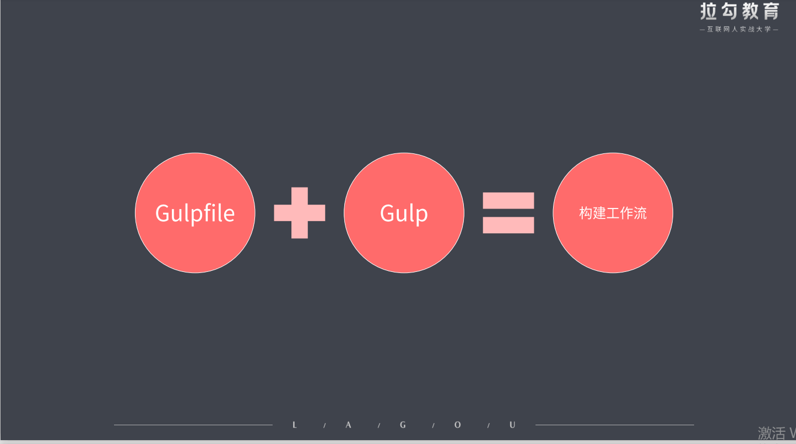

# 3. 自动化构建

一切重复工作本应自动化

自动化

自动化构建

自动化构建工具流

自动化构建初体验

- 正常编写 css 运行在浏览器中
  

- 编写 less 文件，通过自动化构建将 less 转换成浏览器认识的 css 文件
  

NPM Scripts

- 实现自动化构建工作流的最简方式

常用的自动化构建工具

- Grunt
- Gulp
- FIS

## 3.1 Grunt

基本使用

标记任务失败

配置选项方法

多目标任务

文件路劲的处理

插件的使用

实现常用的构建任务

## 3.2 Gulp

基本使用

创建组合任务

异步任务的三种方式

构建过程核心工作原理

- 流式构建系统
  

文件操作 API + 插件的使用

Gulp 自动化构建案例

- 样式文件编译任务
- 脚本文件编译任务
- 页面文件编译任务
- 图片和字体文件的转换
- 其他文件及文件清除
- 自动加载插件
- 热更新开发服务器
- 监视变化以及构建过程优化
- useref 文件引用处理
- 分别压缩 HTML、CSS、JavaScript
- 重新规划构建过程
- 补充

封装自动化构建工作流

- 提取 Gulpfile 到模块
- 解决模块中的问题
- 抽象路劲配置
- 包装 Gulp CLI
- 发布并使用模块
- 总结

## 3.3 FIS

基本使用

高度集成

编译与压缩
